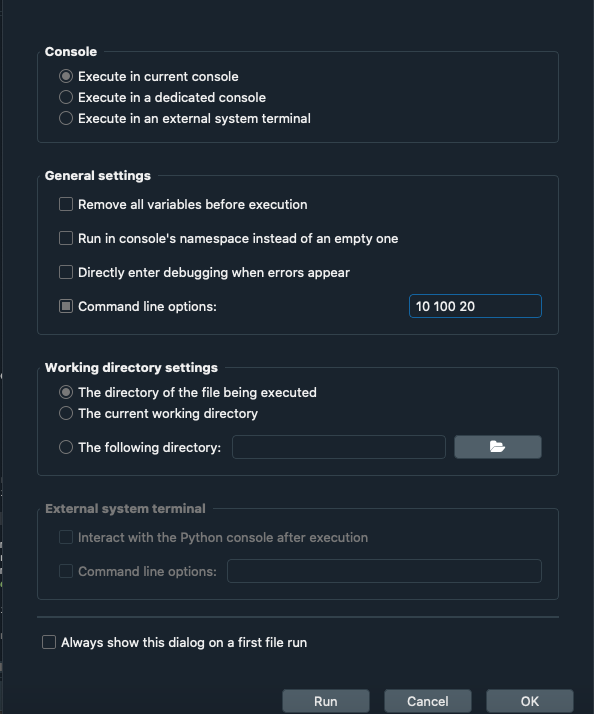
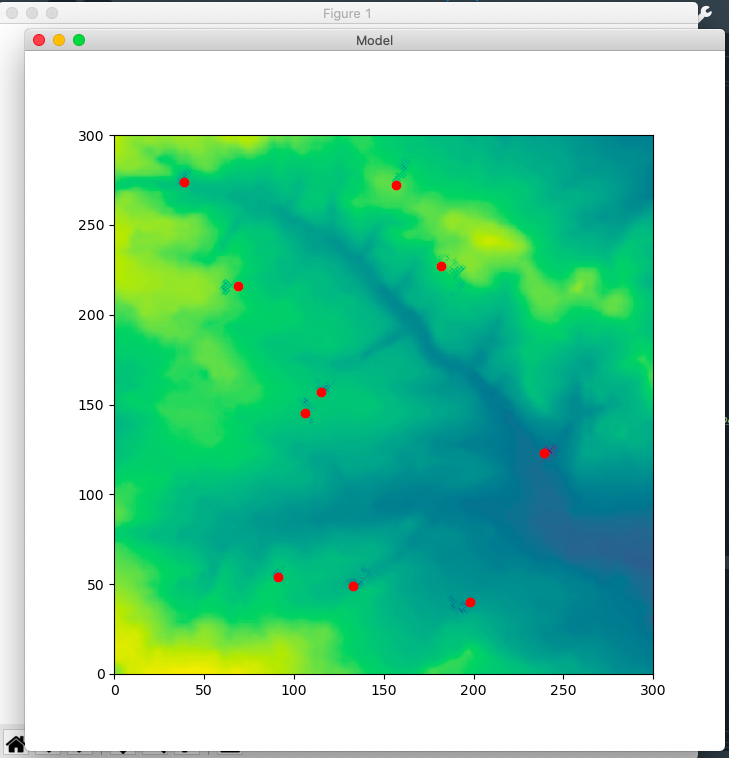

# Agent Based Model Practical
Assignment 1.

## Project Description:

The aim of this project is to build a simple agent-based model, a tool often used by programmers in the social sciences. It is built using the instructions and suggestions from the ["Programming for Social Scientists: Core skills"](https://www.geog.leeds.ac.uk/courses/computing/study/core-python-phd/) course from the University of Leeds. The code produces an animation of the Agents interacting with the environment and each other, and includes a simple GUI using Tkinter. An output file of the environment data after the simulation is optionally produced.

## Repository Contents
Files included in the repository are as follows.

`modefinal.py`: This is the main file of the program. It deals with interaction with the user (i.e setting up the Tkinter GUI) as well as setting up the model. It reads in the environment data, runs the model iterations, checks the stopping condition, and creates the animation of the Agents interacting with the environment. When we run this file, we input the initial arguments from the command line in the following order: number of agents, number of iterations, neighbourhood (distance at which agents interact with each other).

`agentframeworkfinal.py`: Builds the `Agent()` class. As well as recording the Agent's position (i.e the x,y coordinates), they will also contain a list of the environmment and other Agents they might interact with. The number of Agent instances that can interact with each other is limited by the `neighbourhood` parameter, which defines the maximum distance at which interaction is allowed by the program. Within this file, we also define the behaviours we will assign to our Agents. Currently, the Agent can execute 3 different behaviours: `eat()` (eat resources from the environment), `move()` (move randomly in x/y direction), and `share_with_neighbours()` (share resources evenly with neighbours that are within a radius of `neighbourhood` away. 

`in.txt`: Text file that contains the environment data with which the Agents will interact. 

`outfile.txt`: This file exists optionally. It is created after the simulation is run, and the user can choose to save the environment data to this file.

`test.py`: Tests functionality of the program. Checks whether the default values are used when non-integer/incorrect number of parameters an inputted into the command line.

`older_versions`: Folder including the older versions of the code. Useful only to see the evolution of the program.

## How to  run
**1st Method: Using the Spyder interpreter**

You must have [Anaconda](https://www.anaconda.com/products/individual) installed. This will automatically install Python 3 and [Spyder](https://www.spyder-ide.org), which we need to run our program. 

Once this is completed, we install the directory from GitHub onto our computer. We then open the modelfinal.py script, go in the IPython console settings, under Graphics and select Backend: Tkinter from the dropdown menu. This will make sure our animation runs properly.

After this step, we are need to add in our command line arguments. In order to do this, hover over the top bar menu, click on Run, and in the drop down menu click on Configuration per file. Tick command line options, and type in three integers that will be our initial parameters: number of agents, number of iterations, and neighbourhood. This last argument represents the minimum distance at which the agents interact with each other. If one of the parameters given is not an integer, the program will use the default values. Similarly, if no parameters are given, the program will run with the default values.

We can now run the script by clicking the "Run" option in Spyder.

Running the script should open up 2 windows. One is called Model, and will be our GUI where we can run our animation. The other window that opens up is an empty Fig 1 window, which must be kept open at all times whilst the program is running, otherwise the animation will not work.

* Note: I use a Mac, so your GUI might look different if using Windows.

From our Model window, we choose "Run Model" from the menu bar to see the animation of the Agents. During the animation, we can also choose the "Print agents" option from the menu bar to see the state of the agents at each iteration. When the animation has finished running, we can save our environment data to an outfile called "outfile.txt" that will be saved inside the same directory as the other files included in the program. This can be accessed via the "Save environment data" option in the menu bar. Finally, when you want to close the program, you can do this by clicking on the "Exit" option in the menu bar of our GUI.

**2nd Method: Using Terminal**

Install the respository onto your computer from GitHub. Open up Terminal and navigate into the project folder. The program can now be run as follows.

Example:
`python modelfinal.py 10 100 20`

Here, the command line arguments after `python modelfinal.py` represent as before our initial parameters: number of agents, number of iterations, and neighbourhood. These must be integers. If one of the parameters given is not an integer, the program will use the default values. Similarly, if no parameters are given, the program will run with the default values.

Upon running the model, a new window should appear called "Model". This is our GUI, and from the menu bar we can choose, as before, to "Run model", "Print agents", "Save environment data", or "Exit" from the program". When clicking on "Run Model", the animation should appear.

## Tests
Include images here.

## Known issues
1) When running from Spyder, the empty Fig 1 window appears. However when running from Terminal, this is not a problem.

## Further improvements
The current model is fairly simple, and a lot more could be added to make it more complex. For example, more beahviours could be added to the `Agents()` class, such as a `death()` function, `reproduction()`, etc. In addition, it could be interesting to add a predator class that competes with our current `Agent()` class.
